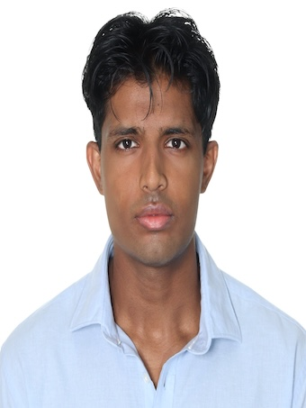
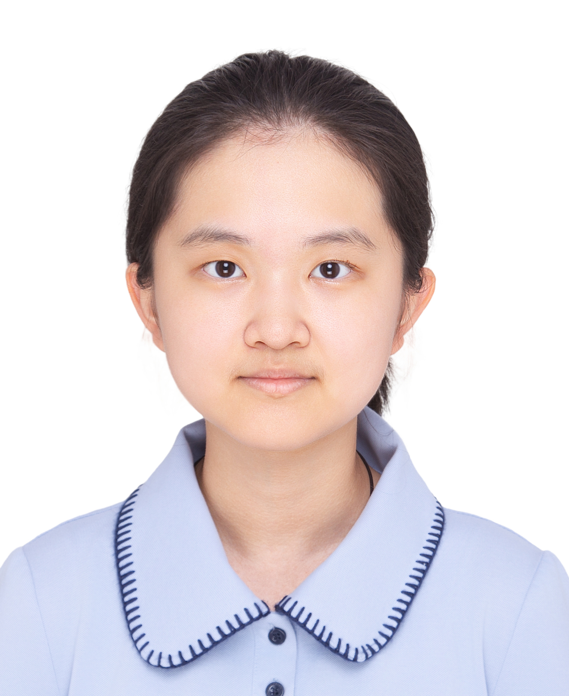
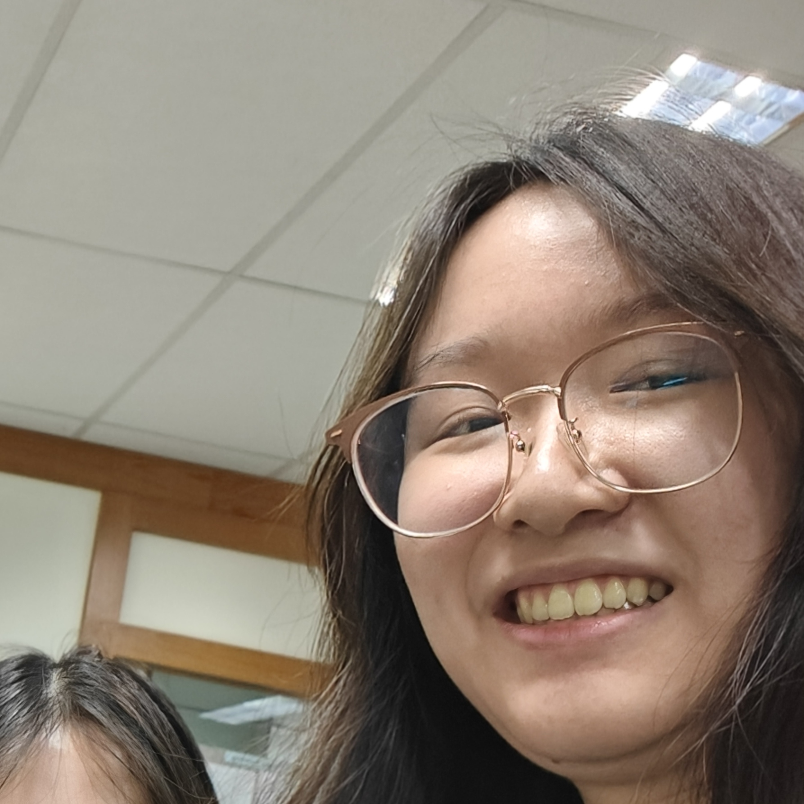
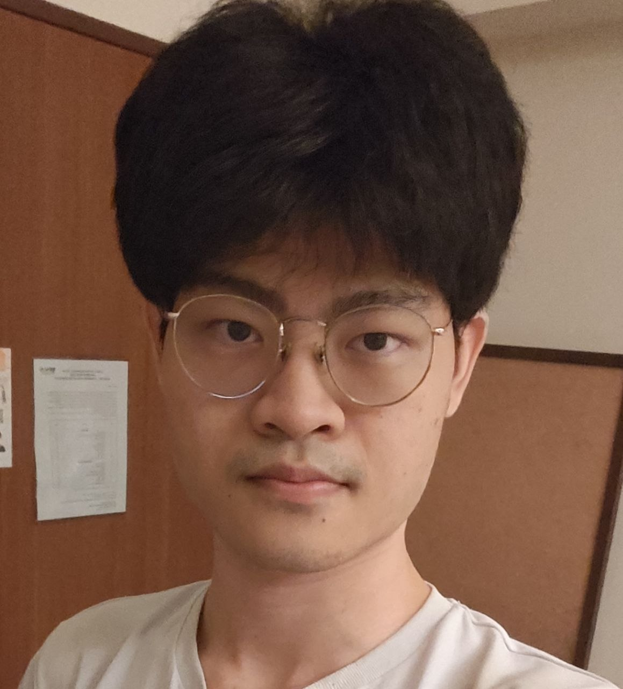

# About Us

We are a team based in the [School of Computing, National University of Singapore](http://www.comp.nus.edu.sg).

You can reach us at the email `seer[at]comp.nus.edu.sg`

## Project team

### Aahil

[[github](https://github.com/aahilma)]

- Role: Project Advisor

### Yuning

[[github](http://github.com/jiangyuning07)]

- Role: Team Lead
- Responsibilities: UI

### Ke Ying

[[github](http://github.com/Oofky)]

- Role: Developer
- Responsibilities: Data

### Aayan

[[github](http://github.com/aayanvatsa04)]

- Role: Developer
- Responsibilities: Dev Ops + Threading

### Young Yi Heng

[[github](http://github.com/yyihengg)]

- Role: Developer
- Responsibilities: UI
