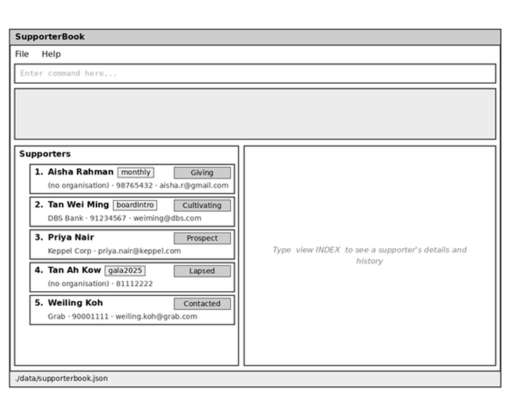

# AB-3 User Guide

AddressBook Level 3 (AB3) is a **desktop application for managing contacts, optimized for use through a Command Line Interface (CLI)** while retaining the benefits of a Graphical User Interface (GUI). If you type quickly, AB3 can help you manage contacts faster than traditional GUI applications.

<!-- * Table of Contents -->
<page-nav-print />

--------------------------------------------------------------------------------------------------------------------

## Quick start

1. Ensure that Java `25` or later is installed on your computer.<br>
   **Mac users:** Ensure you have the precise JDK version prescribed [here](https://se-education.org/guides/tutorials/javaInstallationMac.html).

1. Download the latest `.jar` file from [here](https://github.com/se-edu/addressbook-level3/releases).

1. Copy the file to the folder you want to use as the _home folder_ for your AddressBook.

1. Open a terminal, `cd` to the folder containing the JAR file, and run `java -jar addressbook.jar`.<br>
   A GUI similar to the one below should appear in a few seconds. Note how the app contains some sample data.<br>
   

1. Type a command in the command box and press Enter to execute it. For example, type **`help`** and press Enter to open the help window.<br>
   Some example commands you can try:

   * `list` : Lists all contacts.

   * `add n/John Doe p/98765432 e/johnd@example.com a/John street, block 123, #01-01` : Adds a contact named `John Doe` to the Address Book.

   * `delete 3` : Deletes the 3rd contact shown in the current list.

   * `clear` : Deletes all contacts.

   * `exit` : Exits the app.

1. Refer to the [Features](#features) section below for details of each command.

--------------------------------------------------------------------------------------------------------------------

## Features

<box type="info" seamless>

**Notes about the command format:**<br>

* Words in `UPPER_CASE` are the parameters to be supplied by the user.<br>
  For example, in `add n/NAME`, replace `NAME` with a value such as `John Doe`.

* Items in square brackets are optional.<br>
  For example, `n/NAME [t/TAG]` can be used as `n/John Doe t/friend` or as `n/John Doe`.

* Items followed by `...` can appear zero or more times.<br>
  For example, `[t/TAG]... ` may be omitted, or written as `t/friend` or `t/friend t/family`.

* Parameters can be in any order.<br>
  For example, if the command specifies `n/NAME p/PHONE_NUMBER`, `p/PHONE_NUMBER n/NAME` is also acceptable.

* Extraneous parameters for commands that take no parameters, such as `help`, `list`, `exit`, and `clear`, are ignored.<br>
  For example, `help 123` is interpreted as `help`.

* If you are using a PDF version of this document, be careful when copying and pasting commands that span multiple lines as space characters surrounding line-breaks may be omitted when copied over to the application.
</box>

### Viewing help: `help`

Shows a message explaining how to access the help page.


Format: `help`


### Adding a person: `add`

Adds a person to the address book.

Format: `add n/NAME [p/PHONE_NUMBER] [e/EMAIL] [a/ADDRESS] [o/ORGANISATION] [st/STAGE] [t/TAG]... `

* At least one of `p/PHONE_NUMBER` and `e/EMAIL` must be given, so that there is a way to reach the supporter. Online donors often give only an email, and people met at events often give only a number.
* `a/ADDRESS` can be left out, e.g. when you do not know a corporate contact's postal address.
* `ORGANISATION` is the company or group the supporter belongs to, e.g. the company a CSR contact speaks for. Leave out `o/ORGANISATION` for individual donors.
* `ORGANISATION` can contain any characters (e.g. `Procter & Gamble`), must not be blank, and can be at most 100 characters long. Extra spaces are removed.
* `STAGE` is the supporter's cultivation stage, and must be one of `prospect`, `contacted`, `cultivating`, `giving`, `lapsed` or `declined`. Upper and lower case are both accepted.
* If `st/STAGE` is left out, the new supporter starts at stage `Prospect`.
* `PHONE_NUMBER` must contain only digits, and be between 3 and 15 digits long.
* Extra spaces in `NAME` are removed, e.g. `n/  Tan   Wei Ming` is saved as `Tan Wei Ming`.
* Two supporters cannot have the same name. Names are compared ignoring capital letters and extra spaces, so `tan wei ming` is the same supporter as `Tan Wei Ming`. If two different people share a name, add something to tell them apart, e.g. `n/Tan Wei Ming DBS`.

<box type="tip" seamless>

**Tip:** A person can have any number of tags, including zero.
</box>

Examples:
* `add n/John Doe p/98765432 e/johnd@example.com a/John street, block 123, #01-01`
* `add n/Betsy Crowe t/friend e/betsycrowe@example.com a/Newgate Prison p/1234567 t/criminal`
* `add n/Aisha Rahman e/aisha.r@gmail.com` adds an online donor who gave only an email.
* `add n/John Lim p/81112222 e/johnlim@example.com a/Bedok North Ave 1 st/lapsed` adds a past donor at stage `Lapsed`.
* `add n/Tan Wei Ming p/91234567 e/weiming@dbs.com a/12 Marina Boulevard o/DBS Bank` adds a CSR contact at DBS Bank.

### Listing all persons: `list`

Shows a list of all persons in the address book.

Format: `list`

### Editing a person: `edit`

Edits an existing person in the address book.

Format: `edit INDEX [n/NAME] [p/PHONE] [e/EMAIL] [a/ADDRESS] [o/ORGANISATION] [t/TAG]... `

* Edits the person at the specified `INDEX`. The index refers to the index number shown in the displayed person list. The index **must be a positive integer** 1, 2, 3, ...
* At least one of the optional fields must be provided.
* Existing values will be updated to the input values.
* When editing tags, all of the person's existing tags are removed; adding tags is not cumulative.
* To remove all of a person's tags, enter `t/` without a tag after it.
* A supporter's stage cannot be changed with `edit`, and stays the same when other details are edited. Use the `stage` command instead.
* A supporter's name cannot be changed to the name of another supporter, using the same comparison as `add`. Changing only the capitalisation of their own name is allowed.

Examples:
*  `edit 1 p/91234567 e/johndoe@example.com` Edits the phone number and email address of the 1st person to be `91234567` and `johndoe@example.com` respectively.
*  `edit 2 n/Betsy Crower t/` Edits the name of the 2nd person to be `Betsy Crower` and clears all existing tags.
*  `edit 3 o/OCBC Bank` Changes the organisation of the 3rd supporter to `OCBC Bank`, e.g. after they change jobs.

### Setting a supporter's stage: `stage`

Changes how far the relationship with a supporter has progressed.

Format: `stage INDEX STAGE`

* Sets the stage of the supporter at the specified `INDEX`. The index refers to the index number shown in the displayed supporter list. The index **must be a positive integer** 1, 2, 3, ...
* `STAGE` must be one of the six stages below. Upper and lower case are both accepted. No prefix is needed before it.
* Any stage can be changed to any other stage, e.g. a lapsed donor can be moved back to `cultivating`.
* If the supporter is already at that stage, nothing is changed and a message says so.
* The displayed list stays the same, so a `find` result is kept.

Stage | Meaning
------|--------
`Prospect` | Identified as a possible supporter, not yet approached. New supporters start here.
`Contacted` | First approach made, with no real conversation yet.
`Cultivating` | In an active relationship or discussion, not yet giving.
`Giving` | Currently donating (an individual) or partnering (a company).
`Lapsed` | Gave before, but is no longer giving.
`Declined` | Said no.

Each supporter's stage is shown as a coloured badge next to their name in the list.

Examples:
* `stage 2 cultivating` moves the 2nd supporter in the displayed list to stage `Cultivating`.
* `find Tan` followed by `stage 1 GIVING` moves the 1st supporter in the results of the `find` command to stage `Giving`.

### Locating persons by name: `find`

Finds persons whose names contain any of the given keywords.

Format: `find KEYWORD [MORE_KEYWORDS]`

* The search is case-insensitive; for example, `hans` matches `Hans`.
* Keyword order does not matter; for example, `Hans Bo` matches `Bo Hans`.
* The search considers only names.
* Only full words match; for example, `Han` does not match `Hans`.
* Persons matching at least one keyword are returned (an `OR` search); for example, `Hans Bo` returns `Hans Gruber` and `Bo Yang`.

Examples:
* `find John` returns `john` and `John Doe`
* `find alex david` returns `Alex Yeoh`, `David Li`<br>
  

### Deleting a person: `delete`

Deletes the specified person from the address book.

Format: `delete INDEX`

* Deletes the person at the specified `INDEX`.
* The index refers to the index number shown in the displayed person list.
* The index **must be a positive integer** 1, 2, 3, ...

Examples:
* `list` followed by `delete 2` deletes the 2nd person in the address book.
* `find Betsy` followed by `delete 1` deletes the 1st person in the results of the `find` command.

### Clearing all entries: `clear`

Clears all entries from the address book.

Format: `clear`

### Exiting the program: `exit`

Exits the program.

Format: `exit`

### Saving the data

AddressBook automatically saves data after every command. You do not need to save manually.

### Editing the data file

AddressBook data is saved automatically as a JSON file `[JAR file location]/data/addressbook.json`. Advanced users are welcome to update data directly by editing that data file.

Each supporter in the data file has a `"stage"`, which records how far the relationship has progressed. It must be one of `Prospect`, `Contacted`, `Cultivating`, `Giving`, `Lapsed` or `Declined` (upper or lower case). A supporter's stage stays the same when you edit their other details.

A supporter's `"phone"`, `"email"` and `"address"` keys can each be left out if the supporter does not have one, but every supporter must have at least one of `"phone"` and `"email"`.

A supporter may also have an `"organisation"`, such as the company a CSR contact works for. Leave the key out if the supporter has no organisation. If present, it must not be blank and must be at most 100 characters long.

Each supporter card in the list shows the supporter's organisation, or `(no organisation)` if they have none.

A supporter's `"interactions"` array stores their interaction history in logging order. Each entry has a `"date"` in `yyyy-MM-dd` format and a non-blank `"note"` of at most 500 characters. For example:

```json
"interactions" : [ {
  "date" : "2026-10-11",
  "note" : "Called to discuss the year-end appeal"
} ]
```

The array may be empty or left out when the supporter has no interactions. A missing array is also how data files created before interaction histories were introduced remain compatible.

<box type="warning" seamless>

**Caution:**
If your changes make the data file invalid (e.g., a supporter's `"stage"` is missing or is not one of the six stages), AddressBook starts with an empty address book at the next run. The invalid file remains on disk until you run a command (AddressBook saves after every command). Still, we recommend backing up the file before editing it.<br>
Furthermore, certain edits can cause the AddressBook to behave in unexpected ways (e.g., if a value entered is outside of the acceptable range). Therefore, edit the data file only if you are confident that you can update it correctly.
</box>

### Archiving data files `[coming in v2.0]`

_Details coming soon ..._

--------------------------------------------------------------------------------------------------------------------

## FAQ

**Q**: How do I transfer my data to another computer?<br>
**A**: Install the app on the other computer and overwrite the data file it creates with the data file from your previous AddressBook home folder.

--------------------------------------------------------------------------------------------------------------------

## Known issues

1. **When using multiple screens**, if you move the application to a secondary screen, and later switch to using only the primary screen, the GUI will open off-screen. The remedy is to delete the `preferences.json` file created by the application before running the application again.
2. **If you minimize the Help Window** and then run the `help` command (or use the `Help` menu, or the keyboard shortcut `F1`) again, the original Help Window will remain minimized, and no new Help Window will appear. The remedy is to manually restore the minimized Help Window.

--------------------------------------------------------------------------------------------------------------------

## Command summary

Action     | Format, Examples
-----------|----------------------------------------------------------------------------------------------------------------------------------------------------------------------
**Add**    | `add n/NAME [p/PHONE_NUMBER] [e/EMAIL] [a/ADDRESS] [o/ORGANISATION] [st/STAGE] [t/TAG]... ` <br> e.g., `add n/James Ho p/22224444 e/jamesho@example.com a/123, Clementi Rd, 1234665 o/DBS Bank st/contacted t/friend t/colleague`
**Clear**  | `clear`
**Delete** | `delete INDEX`<br> e.g., `delete 3`
**Edit**   | `edit INDEX [n/NAME] [p/PHONE_NUMBER] [e/EMAIL] [a/ADDRESS] [o/ORGANISATION] [t/TAG]... `<br> e.g.,`edit 2 n/James Lee e/jameslee@example.com`
**Find**   | `find KEYWORD [MORE_KEYWORDS]`<br> e.g., `find James Jake`
**List**   | `list`
**Stage**  | `stage INDEX STAGE`<br> e.g., `stage 2 cultivating`
**Help**   | `help`
